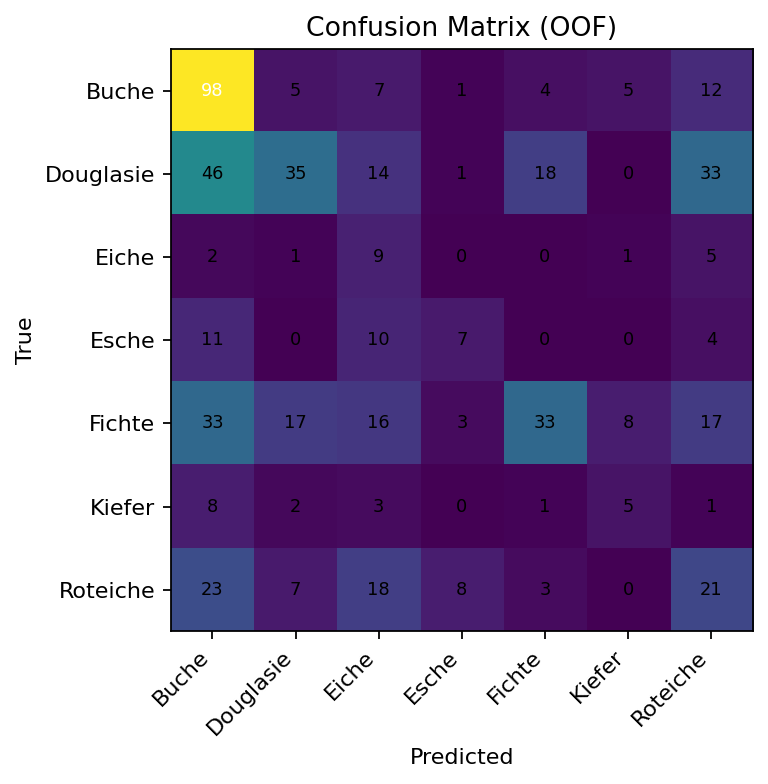

# Tree Species Classification — TRAITEMENT DES DONNÉES MULTIMÉDIA

[](https://www.python.org/)
[](https://pytorch.org/)
[](http://www.open3d.org/)
[](https://scikit-learn.org/)
[](https://xgboost.ai/)

---

> **Project Name:** Tree Species Classification from Point Clouds  
> **Module:** Academic project carried out within the course *"TRAITEMENT DES DONNÉES MULTIMÉDIA"* at ENS Tétouan.  
> **Short:** A comparative study and implementation of multiple classification pipelines that transform 3D point-cloud scans of individual trees into robust species-level predictions.

---

- [Project Overview](#project-overview)
- [Key Technologies & Logos](#key-technologies--logos)
- [Dataset & Preprocessing](#dataset--preprocessing)
- [Methodology & Pipelines](#methodology--pipelines)
  - [Indirect: Multi-view 2D Approaches](#indirect-multi-view-2d-approaches)
  - [Quasi-Direct: 3D Descriptors + Classical ML](#quasi-direct-3d-descriptors--classical-ml)
  - [Direct: Point Cloud Deep Models](#direct-point-cloud-deep-models)
  - [Bonus & Ensembling](#bonus--ensembling)
- [Evaluation Metrics](#evaluation-metrics)
- [Results Overview](#results-overview)
- [Project Structure (files & folders)](#project-structure-files--folders)
- [Quick Start & Example Commands](#quick-start--example-commands)
- [Design Diagrams & Flowcharts](#design-diagrams--flowcharts)
- [Reproducibility & Experiments Logging](#reproducibility--experiments-logging)
- [Best Practices & Tips](#best-practices--tips)
- [License & Acknowledgements](#license--acknowledgements)

---

# Project Overview

This repository implements a **multi-path classification framework** that converts raw 3D point clouds of trees into species label predictions.  
The goal is to evaluate and compare a set of *diverse* methods — from lightweight classical pipelines to state-of-the-art point-cloud deep networks — under a consistent preprocessing and evaluation protocol.

Key properties:

- Multi-modal processing: 2D rendered views, handcrafted 3D descriptors, and direct point-cloud learning.  
- Reproducible experiments with clear logging and consistent validation splits.  
- Designed for constrained hardware (e.g., CPU or low-end GPU) but scalable to full GPU training.

---

# Key Technologies & Logos

| Category        | Name                                | Purpose                                                  |
| --------------- | ----------------------------------- | -------------------------------------------------------- |
| Language        | **Python 3.8+**                     | Main implementation language, scripting, experiments     |
| Deep Learning   | **PyTorch**                         | Model definition, training, checkpoints                  |
| 3D Processing   | **Open3D**                          | Point cloud IO, visualization, FPS sampling, normals     |
| Rendering       | **pyrender / offscreen**            | Multi-view rendering of point clouds to 2D images        |
| Computer Vision | **torchvision**                     | Pretrained CNN backbones (ResNet / EfficientNet)         |
| ML Toolbox      | **scikit-learn**                    | Baselines, metrics, classical models (SVM, RandomForest) |
| Boosting        | **XGBoost**                         | Fast gradient boosting for tabular features              |
| Logging         | **TensorBoard / WandB (optional)**  | Training curves, hyper-parameter tracking                |
| Utilities       | **OpenCV**                          | Image preprocessing & augmentation                       |

---

# Dataset & Preprocessing

**Dataset**: The dataset contains per-tree 3D point clouds grouped by species (Buche, Douglasie, Fichte, Kiefer, Roteiche, etc.).  
A `test.csv` split defines the held-out evaluation set.

**Dataset composition:**  
- 7 classes of species  
- Formats: `.pts`, `.xyz`, `.txt`  
- 556 training samples / 135 test samples  
- After FPS, each cloud is uniformly downsampled to **1024 points**  
- Strong imbalance between classes (*Douglasie >> Esche, Kiefer*)

### Preprocessing Steps
1. **Cleaning & normalization:** centering + unit scaling.  
2. **Sampling (FPS):** ensures equal number of points per object.  
3. **Rendering (12 views):** generate 2D silhouettes (`224×224`) for Hu descriptors.  
4. **Descriptor extraction:** compute Hu moments (2D) and PCA (3D).  
5. **Caching:** store processed data under `/data/processed/`.

---

# Methodology & Pipelines

### Indirect: Multi-view 2D Approaches
Render the 3D object into 12 2D silhouettes → extract **Hu moments** → classify with **Naïve Bayes** or **SVM**.  
Also supports deep CNN (ResNet50) for learned embeddings.

### Quasi-Direct: 3D Descriptors + Classical ML
Compute 3D **PCA descriptors** or **FPFH histograms**, then classify with Naïve Bayes or Logistic Regression.

### Direct: Point Cloud Deep Models
Implement **PointNet** and **DGCNN** for end-to-end learning from 3D points (N=1024).  
Augmentations: jitter, scaling, rotation.  
Training on PyTorch with class-balanced sampler.

### Bonus & Ensembling
Use a **Stacking ensemble** that merges Hu-based and PCA-based model outputs with a logistic regression meta-classifier.  
This setup provided the **best performance overall** under data imbalance.

---

# Evaluation Metrics

| Metric              | Description |
| ------------------- | ------------ |
| **Accuracy** | Overall correct predictions |
| **Balanced Accuracy** | Average recall across classes |
| **Macro-F1** | Global performance independent of class size |
| **Precision/Recall per class** | Diagnostic of class-level imbalance |
| **Confusion Matrix** | Identifies systematic confusions (e.g., Douglasie ↔ Fichte) |

---

# Results Overview

### Quantitative summary

| Model | Accuracy | Balanced Accuracy | F1-Macro | Notes |
|-------|-----------|------------------|----------|-------|
| Naïve Bayes (Hu+PCA) | 0.43 | 0.35 | 0.32 | Light baseline |
| Stacking (Hu/PCA + LR) | 0.48 | 0.29 | 0.26 | Best global stability |
| PointNet | ~0.00 | – | – | No convergence on limited data |

**Observations:**  
- *Stacking* (Hu+PCA) performed best overall.  
- Hu captures global shape; PCA captures anisotropy.  
- Logistic regression meta-learner improved robustness under imbalance.  
- Balanced Accuracy and Macro-F1 are more meaningful than raw Accuracy.

---

### Visual Outputs

#### 🧠 Poster Final


#### 🔵 Confusion Matrix (OOF)


#### 📊 Code Frequency (GitHub)
.png)

---

# Project Structure (files & folders)

```text
project_root/
├─ data/
│  ├─ raw/                 # original point clouds and csvs
│  └─ processed/           # sampled point clouds, views, descriptors
├─ notebooks/              # EDA and quick experiments
├─ src/
│  ├─ preprocessing/       # point cloud cleaning, FPS, render_views.py
│  ├─ features/            # descriptor extraction (3D and 2D)
│  ├─ models/              # implementations: pointnet, multiview, classifiers
│  ├─ train.py             # unified training entrypoint
│  └─ eval.py              # produces metrics & confusion matrices
├─ experiments/            # experiment configs + saved checkpoints
├─ results/                # metrics, plots, confusion matrices
├─ requirements.txt
└─ README.md
